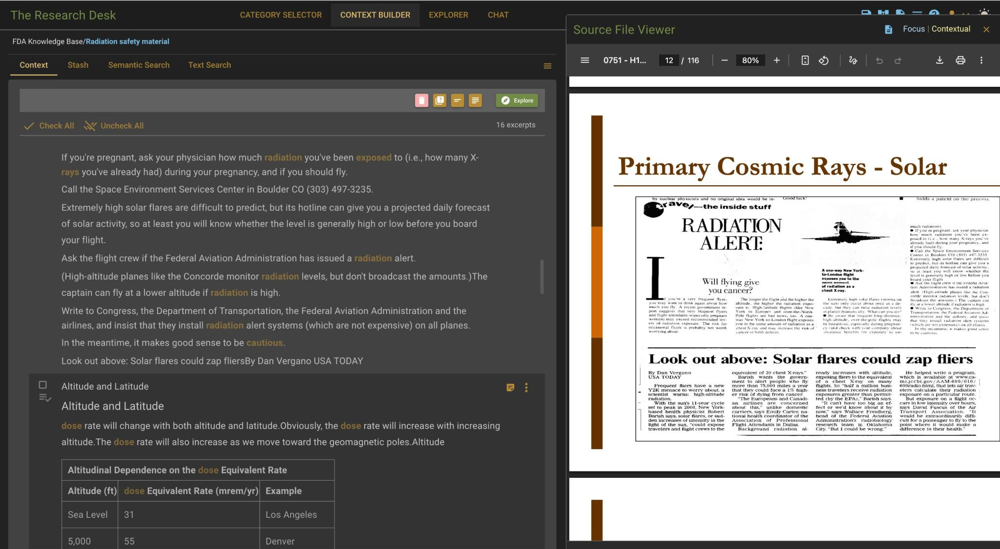
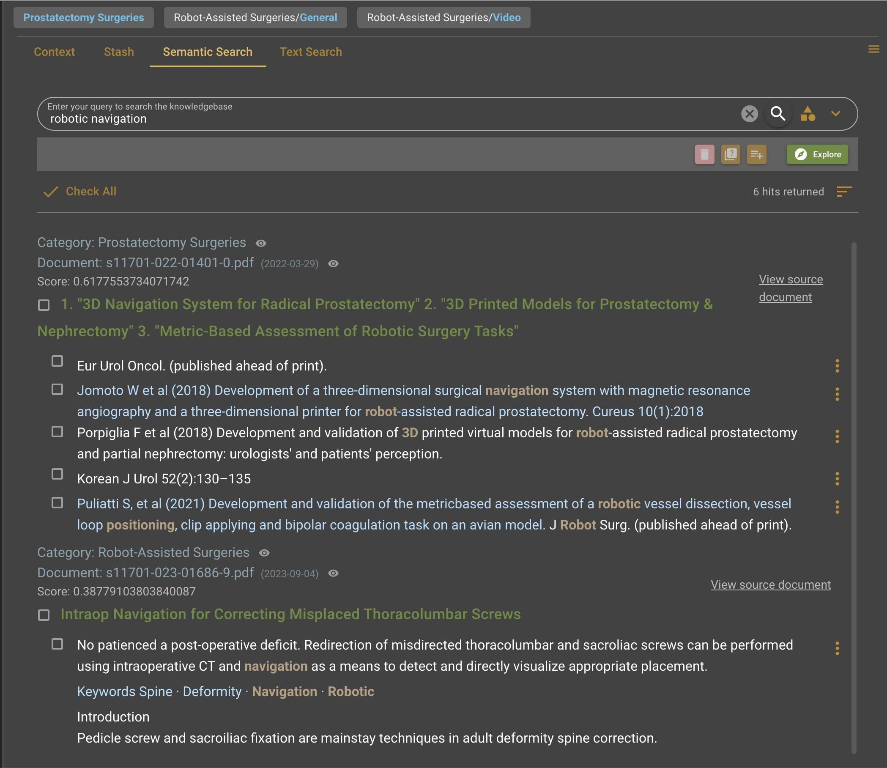
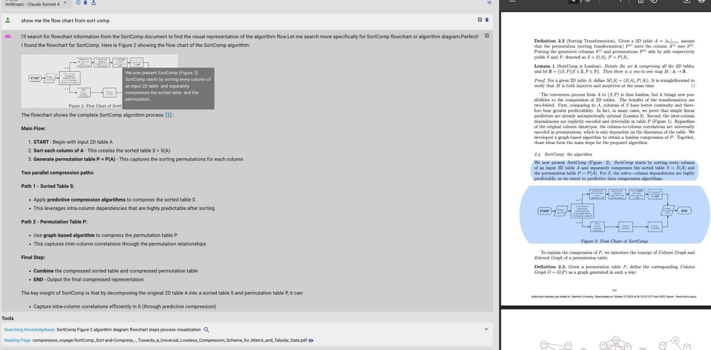
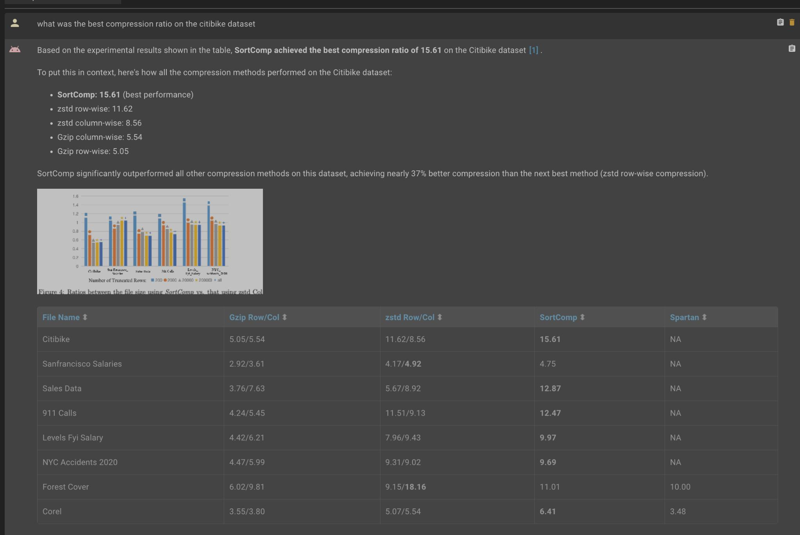
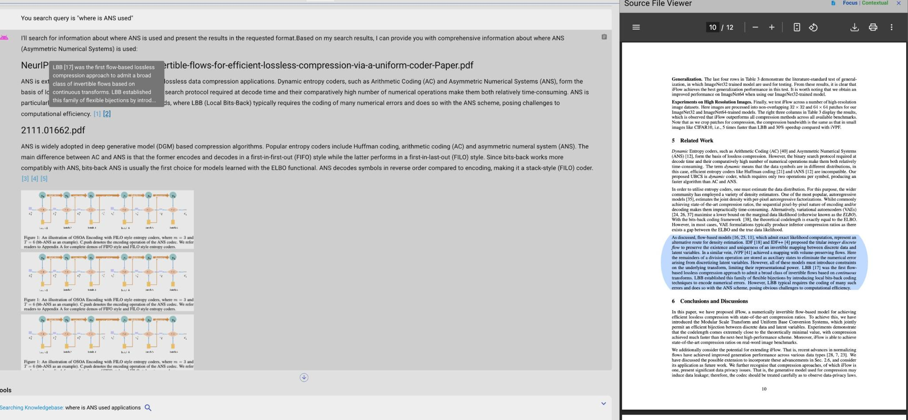

# The Research Desk
There's an irony at the heart of AI tooling: the machines have learned to read and yet we still search like it's 2003. Research Desk is a personal knowledge base for your PDFs with semantic search as a first class citizen.
Similar in spirit to [Andrej Karpathy's knowledge bases](https://x.com/karpathy/status/2039805659525644595?s=20) or google's notebook LM but with a few new ideas.

<figure>
  
  <figcaption><em>Semantic keyword bolding, Tables shown in search results, jump from search result to the page in the pdf viewer</em></figcaption>
</figure>

---

<figure>
  
  <figcaption><em>Text in green is the dynamically generated titles describing search results. Click the eye to see summary of a document or category</em></figcaption>
</figure>

---

<figure>
  
  <figcaption><em>Queries searched by agent shown at bottom. Click to see the search results the agent saw</em></figcaption>
</figure>

---

<figure>
  
  <figcaption><em>Image from pdf shown directly in agent chat response. Jump from citation to the page in the pdf viewer</em></figcaption>
</figure>

---

<figure>
  
  <figcaption><em>tooltip on citation shows the text of the excerpt</em></figcaption>
</figure>

---

I would say the **core difference in this approach compared to other AI knowledge tools is it exposes search results directly to the user**. 
But it is not a traditional search engine. It uses AI at every step: 
- PDF parsing via [marker](https://github.com/datalab-to/marker) which uses gemini to render tables and figures as searchable text. Images of the tables and figures are displayed directly in the search results.
- Every search result has a title dynamically generated by an LLM
- Documents are organized into categories. Your selection of categories scopes both search and agent's retrieval in chat. Embeddings are used to recommend categories based on your search query.
- Every document and category has an LLM generated description
- Video and audio are transcribed and searchable. Clicking a result seeks directly to that moment in the built-in player. 
- Math rendering for formulas found in PDFs
- The user can click to jump directly from a search result to the page in the built-in pdf viewer. Thanks to Marker's layout engine, the pdf viewer can higlight the specific block of text with the excerpt.

Exposing search results to the user seems obvious and yet I have seen no applications with a search experience which is meaningfully different from the usual keyword search. Cursor uses semantic search under the hood and yet it still gives users the same old exact match search from vscode. There is a reason that most user facing search still uses traditional methods: It is because the semantic search results still have terrible aesthetics for human consumption. In order to make search results presentable to humans, the research desk does things differently:
- **precise chunking**: While most RAG systems use a fairly large chunk size, the research desk chunks at the sentence level so that the search results can show precisely the relevant sentences without irrelevant sentences that happen to be in the same chunk. But chunking at the sentence level means that the usual embedding methods would be missing surrounding context, so the research desk uses Voyage AI's late chunking which is a different paradigm that eliminates the tradeoff between small and large chunks. The embedding model sees the entire document at once so that it has full context but outputs embeddings for each individual chunk.
- **higher standard of accuracy**: I took notes on the outputs from many different pdf parsing solutions and found that while marker was the best, it is still not perfect. These mistakes can remain a secret for products that don't show results directly to the user but the research desk requires a higher standard of accuracy. So it has gemini do a second pass to correct the outputs of marker by looking at a screenshot of the pdf page. We have a similar story with the chunking method. All the sentence chunking methods I tried(including ones using ML) have edge cases that produce ugly results so the research desk uses gemini to do agentic chunking. Using gemini for this feels like cracking a nut with a sledgehammer but the other solutions had ugly edge cases which aren't acceptable for human consumption.
- **semantically relevant words in bold**: In the same way traditional search bolds keyword matches, the Research Desk bolds semantically related words by measuring cosine similarity.

## Search and Chat, Woven Together
- **From search results view to agent chat**: Add a search result to the context of the agent (similar to cmd+L in cursor) 
- **From agent chat to search results view**: Every search query the agent fires is shown to the user and clickable. When the user clicks on of these search queries they are taken to the search results for that query to see the same search results the agent saw. 

The agent can cite any excerpt, table or figure in its response. Click a citation to jump to that page in the pdf in the pdf viewer. 
Cited tables and figures are rendered inline in the response, meaning the agent has the ability to display any images from the knowledgebase in it's response.

---

The code is from late 2024 to mid 2025 but I still think there are a few things that are novel about it and potentially worth sharing. 
